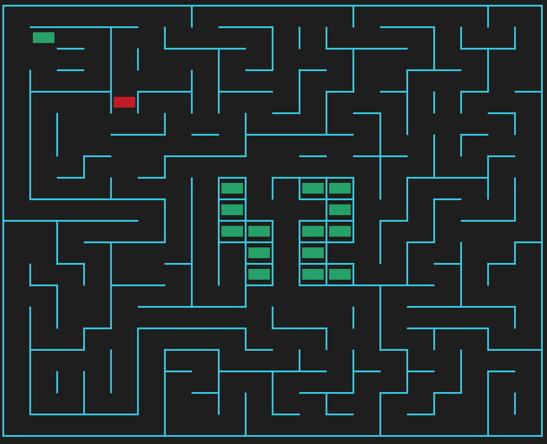
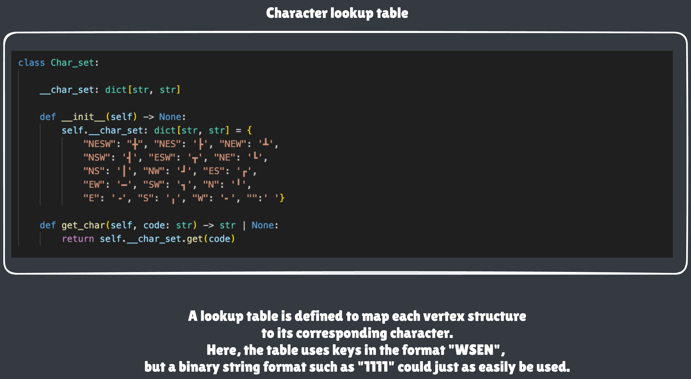

*This project has been created as part of the 42 curriculum by lecavall, cebouhad.*

# Description

This project involves developing a maze generator in Python.\ 
The program will be able to read a configuration file in order to define the parameters of the maze to be generated.\
It will then produce a maze, which may optionally be “perfect,” meaning there is a unique path between the entrance and the exit.

The generated maze will be exported to a file using a hexadecimal wall representation. In addition, the project will include a visual representation of the maze to make it easier to view and understand.

Finally, the code architecture must be designed in a modular way, so that the maze generation engine can be reused in other projects or contexts.



# Instructions

### Create and activate the virtual environment

```bash
make && source venv/bin/activate
```

### Deactivate the virtual environment

```bash
deactivate
```

### Run the main script

```bash
make run
```

### Run the main script with a different configuration file

```bash
make run CONFIG=<config_file>
```

### Run the main script in debug mode

```bash
make debug
```

### Remove temporary files, caches, and the virtual environment

```bash
make clean
```

### Run `flake8` and `mypy`

```bash
make lint
```

### Run `flake8` and `mypy` in strict mode

```bash
make lint-strict
```


# Resources

https://www.sdss.org/dr19/tutorials/using_bitmasks/\
https://en.wikipedia.org/wiki/Box-drawing_characters#Box_Drawing\
https://jrsinclair.com/articles/2025/rendering-mazes-on-the-web/
https://www.algosome.com/articles/maze-generation-depth-first.html
https://plainenglish.io/python/solve-maze-using-breadth-first-search-bfs-algorithm-in-python-7931acbe8a93
https://mypy.readthedocs.io/en/stable/command_line.html#cmdoption-mypy-ignore-missing-imports


## 🤖 AI Usage

Artificial Intelligence tools were used as development assistants during the project.

AI assistance was used for:

* Creates Readme.

All design decisions, implementation, debugging, testing, and final validation were performed manually.


# Config file

The configuration file follows a strict KEY=VALUE format.\
Lines starting with # are comments and are be ignored.

Mandatory example:

```
WIDTH=20
HEIGHT=10
ENTRY=0,0
EXIT=19,9
PERFECT=True
SEED=42
```

# Maze generation algorithm: DFS

The maze is generated by a module called MazeGenerator. The algoritm is called Depth First Search.

Technichal explanation. The DFS Algortihm starts at the entry Cell, marks it as visited, chooses a neighboring Cell randomly, marks that as visited and continues until there is no visitable Cell anymore, because all are visited. When a new Cell is chosen, the adjacency list of the current and the incoming Cell are updated to contain each other, whicht means there is a path between them. 


# Maze solving algorithm: BFS

The maze is solved through an algorithm called Breadth First search. It iterates through a list that always has the nearest Cells to the beginning at it's front. From there, the Cells go through a loop and get noted in a dictionary that tracks where they came from. When the exit Cell is reached, you can rebuild the fastest path to the start via the dictionary.

# Why this algorithm

* Low memory usage: It uses very little memory. It only keeps track of the current path, and it's speed.
* Ideal for deep solutions: It quickly finds the solution if it is located deep within the structure (the tree).
* Adjacency lists for memory efficiency. 

# Reusable Code

The `mazegen` module can be reused as a library in other projects. The package configuration is defined in the `pyproject.toml` file located at the root of the project.

## 1. Build the package

```bash
uv build
```

## 2. Create a virtual environment

```bash
uv venv venv
```

## 3. Activate the virtual environment

```bash
source venv/bin/activate
```

## 4. Install the package

```bash
uv pip install <package_path>
```

# Team and project management

## Leon

* Parsing
* Maze generation algorithm: DFS
* Maze solving algorithm: BFS

## Cedric

* Terminal visualisation
* Output managment

## Leon + Cedric

* Implementation
* Design
* Project Architecture

## Anticipated planning

The project took a little longer than expected. I (Cédric) had to adapt to a new programming language and its associated concepts.

As a result, the project was delayed by a few days while I worked through several modules from the Python Piscine to become familiar with the language and its ecosystem.

## What worked well

Worked well: Communication was clear and effective throughout the project.

What could be improved: Strengthening teamwork and collaboration within the team.

# Specific tools

We did not use any specific tools. Everything was implemented using Python's standard library.

# Visual representation

## Lookup table

The first step is to create a lookup table (here, a dictionary) that maps each vertex structure to its corresponding character.

A getter function can then be used to query the table. For example:

self.get_char("NEW") -> '┻'



## Terminal Display Algorithm

To display the maze in the terminal, the rendering perspective must be changed. Instead of using the maze cells as the reference, the rendering is based on the **vertices**, which represent the intersection points of the cells. A vertex is the meeting point of four cells. The number of vertices horizontally is equal to the maze width plus one, and the number of vertex rows is equal to the maze height plus one.

For each vertex, two diagonally opposite cells are used as references. For example, for the vertex at coordinates `(2,3)`, the reference cells are `(1,2)` and `(2,3)`.

The cell `(1,2)` and its adjacent cell `(1,3)` are used to determine the presence of the **west** branch of the vertex by checking the **south** wall of `(1,2)` and the **north** wall of `(1,3)`.

The cell `(1,2)` and its adjacent cell `(2,2)` are used to determine the presence of the **north** branch by checking the **east** wall of `(1,2)` and the **west** wall of `(2,2)`.

The cell `(2,3)` and its adjacent cell `(1,3)` are used to determine the presence of the **south** branch by checking the **west** wall of `(2,3)` and the **east** wall of `(1,3)`.

The cell `(2,3)` and its adjacent cell `(2,2)` are used to determine the presence of the **east** branch by checking the **north** wall of `(2,3)` and the **south** wall of `(2,2)`.

Once the vertex structure has been determined, a call to the `get_char()` method of the `CharSet` class returns the Unicode character corresponding to that vertex.

If the vertex's x-coordinate is less than the maze width and the vertex has an east branch, a horizontal fill function is called to append `(cell_width - 2)` copies of the `EW` character.

Finally, a vertical fill function is called to handle the background colors of the **entry**, **exit**, **42**, and **shortest path** cells. If the vertex has a south branch, the `NS` character is printed; otherwise, a space is printed.


## Terminal Display Option

The viewer allows you to customize the color of the maze, the color of the 42 logo, and the color of the shortest path.

```bash

=== A-Maze-ing ===
1. Re-generate a new maze
2. Show/hide path from entry to exit
3. Rotate maze colors
4. Rotate 42 colors
5. Rotate Path colors
6. Quit
Choice? (1-5): 

```

# Output file

## Exemple

```
9153B
AC142
8103A
846AA
C5546

(1, 1)
(4, 4)
ESESSE
```
## Maze Cell Encoding

Each maze cell is associated with an integer ranging from 0 to 15. This integer encodes the cell's wall configuration.\
This hexadecimal integer is used to encode each maze cell in the output file.\

Examples:

0: WSEN -> 0000 → the cell is completely open.\
15: WSEN -> 1111 → the cell is completely enclosed.\
11: WSEN -> 1011 → west closed, south open, east closed, north closed.

During the maze generation algorithm, each cell is associated with a list of neighboring cells. The relative position of a neighboring cell with respect to the current cell determines which wall of the current cell is open.

Example:

(0,0) -> neighbors [(1,0), (0,1)]\
(1,0) is east of (0,0).\
(0,1) is south of (0,0).

Therefore, the west and north wall bits must be activated (set to 1) to indicate that these walls are closed.

```python

value = value | (1 << 3)
value = value | (1 << 2)

```

## Entry and Exit

The output file specifies the maze's entry point and exit point.

## Shortest path

Describes the shortest path between the entrance and the exit.